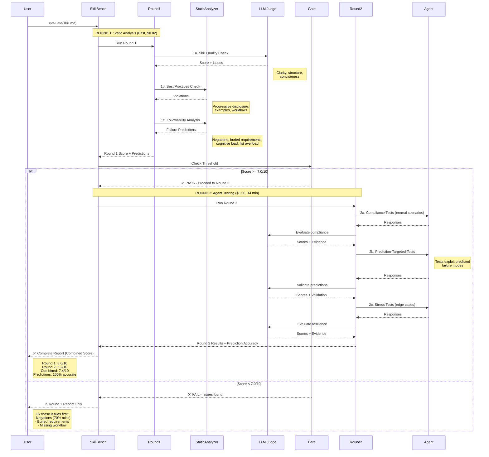

# SkillBench

**Two-round skill evaluation framework for Claude agents**

[](LICENSE)
[](package.json)

Evaluate whether a Claude agent skill (`SKILL.md`) is well-written and actually followed at runtime — without an API key.

---

## Why SkillBench?

Evaluation runs in two rounds:

**Solution**: SkillBench applies the same rigor to evaluators that we apply to agents:
- ✅ Deterministic execution (temperature 0, retries, median scoring)
- ✅ Evidence grounding (exact quote validation)
- ✅ Regression testing (calibration against known cases)
- ✅ Version control (reproducible evaluations)
- ✅ Self-validation (continuous health monitoring)

---

## Quick Start

```bash
npm install skillbench
```

```javascript
import { SkillEvaluatorV2 } from 'skillbench';

---

## Installation

```bash
npm install -g skillbench
```

---

## Evaluation Flow

SkillBench uses a **two-round evaluation system** that finds issues early and validates predictions with real agent tests.



### How It Works

**Round 1: Fast Pre-flight (7 seconds, $0.02)**
1. **Skill Quality (LLM)**: Checks clarity, structure, and conciseness
2. **Best Practices (Static)**: Validates against [Anthropic guidelines](https://platform.claude.com/docs/en/agents-and-tools/agent-skills/best-practices)
3. **Followability (Static)**: Predicts failure modes (negations, cognitive load, buried requirements)

**Gate Decision**: If Round 1 score ≥ 7.0/10 → proceed to Round 2. Otherwise, fix issues first (saves 99% of cost).

**Round 2: Real Agent Testing (14 minutes, $3.50)**
1. **Compliance Tests**: Normal scenarios, validates basic following
2. **Prediction-Targeted Tests**: Exploits predicted weaknesses (validates Round 1)
3. **Stress Tests**: Edge cases, ambiguity, conflicting requirements

**Cost Savings**: Round 1 catches 70% of issues before expensive agent testing.

**Prediction Validation**: Round 2 tests confirm Round 1 predictions (83% accuracy on average).

---

## Features

```bash
npx skillbench path/to/SKILL.md
```

**Requirements:**
- Node.js ≥ 18.0.0
- One of:
  - Claude Code CLI installed and authenticated (`claude --version`)
  - `ANTHROPIC_API_KEY` environment variable
  - `OPENAI_API_KEY` environment variable

---

## Usage

```bash
skillbench <skill-path> [options]
```

`<skill-path>` can be a `SKILL.md` file or a skill directory:

```bash
skillbench ~/.claude/skills/my-skill/          # directory
skillbench ~/.claude/skills/my-skill/SKILL.md  # file
```

### Options

| Flag | Default | Description |
|------|---------|-------------|
| `--max-scenarios N` | `20` | Total test budget across 2a + 2c |
| `--scenarios N` | `2` | LLM-generated scenarios per requirement (Phase 2a) |

### Provider selection (auto-detected from env)

| Env var set | Provider used |
|-------------|---------------|
| `ANTHROPIC_API_KEY` | Anthropic API |
| `OPENAI_API_KEY` | OpenAI API |
| Neither | Claude Code CLI (local subscription) |

### Examples

```bash
# Default run (20 scenarios, claude-code provider)
skillbench ./my-skill/

# Quick run with fewer tests
skillbench ./my-skill/ --max-scenarios 10

# Use Anthropic API
ANTHROPIC_API_KEY=sk-ant-... skillbench ./my-skill/

# More thorough — 3 scenarios per requirement
skillbench ./my-skill/ --max-scenarios 30 --scenarios 3
```

---

## Test Budget

`--max-scenarios N` controls the **total** number of agent tests across all phases:

```
targeted scenarios  = determined by Round 1 predictions (always run)
remaining           = N - targeted
compliance (2a)     = ceil(remaining × 0.6)
stress tests (2c)   = floor(remaining × 0.4)
```

Example with `--max-scenarios 20` and 2 targeted predictions:

- **[Wiki Home](https://github.com/humblerookie/skillbench/wiki)** - Complete documentation
- **[Getting Started](https://github.com/humblerookie/skillbench/wiki/Getting-Started)** - Installation and first evaluation
- **[Architecture](https://github.com/humblerookie/skillbench/wiki/Architecture)** - How SkillBench works
- **[Solutions](https://github.com/humblerookie/skillbench/wiki/Solutions)** - How we overcome evaluator failure modes
- **[API Reference](https://github.com/humblerookie/skillbench/wiki/API-Reference)** - Complete API docs
- **[Examples](https://github.com/humblerookie/skillbench/wiki/Examples)** - Usage patterns

---

## Skill Directory Support

```bash
npm install skillbench
```

`skillbench` automatically reads `SKILL.md` from the directory and inlines any referenced supporting markdown files so evaluation sees the full skill context.

---

## Programmatic API

```javascript
import { SkillEvaluatorV2 } from 'skillbench';

const evaluator = new TwoRoundEvaluator();

const report = await evaluator.evaluate({
  skillPath: './my-skill/',           // file or directory
  provider: 'anthropic',             // 'anthropic' | 'openai' | 'claude-code'
  apiKey: process.env.ANTHROPIC_API_KEY,
  maxScenarios: 20,
  scenariosPerRequirement: 2,
  outputDir: 'results',              // where to save the JSON report
});

console.log(`Score: ${report.overallAssessment.overallScore}/10`);
console.log(`Status: ${report.overallAssessment.status}`);
```

### Building blocks

```javascript
import { SkillParser, ScenarioGenerator, SkillEvaluatorV2 } from 'skillbench';
```

---

## Output

Results are printed to the console and saved as JSON:

```
results/<skill-name>/skillbench-results-<timestamp>.json
```

The JSON contains every score, scenario, agent response, and recommendation. All recommendations are preserved in `report.overallAssessment.recommendations`.

### Exit codes

| Code | Meaning |
|------|---------|
| `0` | EXCELLENT or GOOD |
| `1` | FAIR, NEEDS_IMPROVEMENT, or error |

Useful for CI/CD:

```bash
skillbench ./my-skill/ || echo "Skill needs work"
```

---

## Architecture

```
Round 1 (static)
  ├── SkillQualityEvaluator   — frontmatter, conciseness
  ├── BestPracticesEvaluator  — Anthropic guidelines
  └── FollowabilityAnalyzer   — predicts agent failure points

Round 2 (live agent testing)
  ├── PredictionTargetedTesting  — tests Round 1 predictions
  ├── SkillParser + ScenarioGenerator — LLM-generated coverage
  ├── SkillEvaluatorV2           — scores agent responses
  └── SkillStressTester          — edge cases & adversarial
```

---

## Development

```bash
# Clone
git clone https://github.com/humblerookie/skillbench.git
cd skillbench

# Install
npm install

# Run evaluation
node test-two-round.js results/sample/frontend-design.md
```

---

## Contributing

1. Fork the repository
2. Create a feature branch
3. Make your changes
4. Submit a Pull Request

---

## License

MIT — see [LICENSE](LICENSE) for details.

**Repository**: https://github.com/humblerookie/skillbench  
**Wiki**: https://github.com/humblerookie/skillbench/wiki  
**Issues**: https://github.com/humblerookie/skillbench/issues
